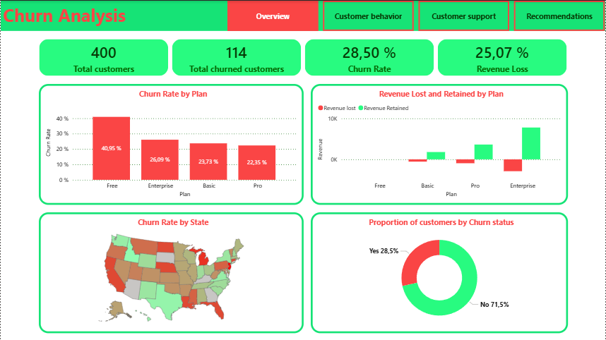
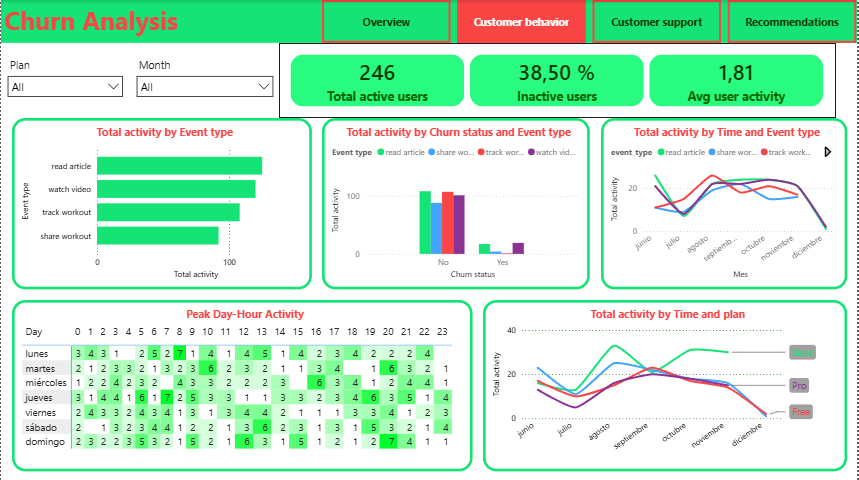
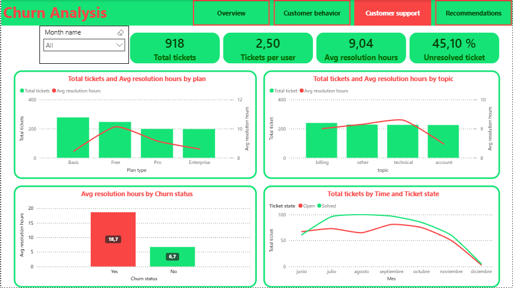

# 📉 Fit.ly Tech Churn Analysis & Retention Strategy Dashboard

## 📌 Project Overview

Customer retention has become a critical challenge for subscription-based businesses.  
Over the last two quarters, **Fit.ly Tech** experienced an increase in customer churn, directly impacting recurring revenue and increasing pressure on acquisition costs.

This project analyzes customer churn behavior using a complete end-to-end data analytics workflow combining:

- 🐍 Python for data cleaning & exploratory analysis
- 🗄️ PostgreSQL for business analysis with SQL
- 📊 Power BI for dashboard development & storytelling

The goal of this project is to identify:
- Key churn drivers
- Revenue impact
- Customer behavioral patterns
- Operational inefficiencies
- Strategic retention opportunities

---

# 🛠️ Tech Stack

| Tool | Purpose |
|---|---|
| 🐍 Python | Data cleaning & exploratory data analysis |
| 🐼 Pandas | Data transformation |
| 📈 Matplotlib / Seaborn | Visual exploration |
| 🗄️ PostgreSQL | Business queries & analysis |
| 📊 Power BI / Tableau | Dashboard development |
| 💻 SQL | Business problem solving |

---

# 📂 Project Workflow

## 1️⃣ Data Cleaning & Preparation (Python)

The raw dataset was cleaned and transformed using Python.

### Tasks Performed
- Missing value handling
- Datetime formatting
- Duplicate removal
- Feature engineering
- Data validation
- Churn labeling
- Behavioral metrics creation

### Engineered Features
- Hour of activity
- Day of week
- Month name
- Revenue metrics
- User activity frequency
- Support resolution hours

---

# 🔍 Exploratory Data Analysis (EDA)

EDA was conducted to uncover behavioral and operational patterns associated with churn.

### Main Areas Explored
- Customer activity trends
- User engagement
- Revenue distribution
- Support performance
- Subscription behavior
- Temporal activity patterns

### Insights
- 📌 The Basic plan is the most popular plan
- 📌 28.5% of customers have churned in the period given
- 📌 Billing issue is reported most frequently
- 📌 The customer support staff has 54.9% of effectiveness solving reported issues
- 📌 The most popular activities on the app are reading article and watching videos
- 📌 A high number of churns are from free accounts
- 📌 Basic plan accounts reported high number of issues
- 📌 A high number of customers use the app to read article and watch videos
- 📌 The most active users are from basic and enterprise plans
- 📌 The number of issues declined significantly in December
- 📌 The avg resolution hours curb significantly in November
- 📌 The peak activity is on Monday and Thursday morning (7 - 8 am), weekend at noon, and on Sunday evening (8 pm)

---

# 🗄️ SQL Business Analysis (PostgreSQL)

After cleaning, the transformed tables were loaded into a PostgreSQL database for business analysis.

### Business Questions Answered
- How many customer are there in each plan?
- What is the churn rate by subscription plan?
- Which support issues are most frequent?
- How long takes on average to solve each kind of issues?
- What is the effectiveness solving problems?
- How many issues was reported in each month?
- Which plan type report more issues?
- What is the most popular activity on the app?
- Which is the most active plan by month?
- When is the peak day-hour activity?

---

# 📊 Dashboard Development

Interactive dashboards were developed to provide stakeholders with actionable insights.

## 📌 Dashboard Sections

### 1️⃣ Executive Overview
Provides a high-level summary of:
- Total customers
- Total churned customers
- Churn rate
- Revenue lost

### 2️⃣ Customer Behavior Dashboard
Analyzes:
- User engagement
- Peak activity hours
- Most used features
- Activity trends

### 3️⃣ Customer Support Dashboard
Focuses on:
- Ticket resolution time
- Support issue categories
- Support by plan type
- Relationship between support experience and churn

### 4️⃣ Strategic Recommendations Dashboard
Converts analytical findings into business actions aimed at:
- Reducing churn
- Improving retention
- Protecting enterprise revenue
- Enhancing customer experience

---

# 📈 Key Findings

## 🚨 Churn & Revenue
- 28.5% of customers churned during the last semester
- Free accounts presented the highest churn rate (**40.95%**)
- Churned customers represented approximately **25% of total revenue**
- Enterprise customers generated the largest revenue losses

---

## 🛠️ Customer Support
- Long support resolution times strongly correlate with churn
- Billing issues were the most reported support problem

---

## 👥 Customer Behavior
- Most users primarily consume:
  - 📚 Articles
  - 🎥 Videos
- Basic and Enterprise plans showed the highest engagement levels

---

## ⏰ User Activity Patterns
Peak activity periods occurred during:
- Monday & Thursday mornings (7–8 AM)
- Weekend noon hours
- Sunday evenings (8 PM)

---

# 💡 Strategic Recommendations

Based on the analysis, the following business recommendations were proposed:

## ✅ Improve Free User Retention
- Enhance onboarding experience
- Introduce personalized feature discovery
- Launch premium trial campaigns

---

## ✅ Protect Enterprise Revenue
- Implement dedicated account management
- Prioritize enterprise support tickets
- Deploy proactive churn monitoring

---

## ✅ Reduce Support Resolution Time
- Optimize ticket routing
- Define SLA targets
- Expand support availability during peak hours

---

## ✅ Resolve Billing Friction
- Simplify payment workflows
- Improve billing transparency
- Develop self-service billing support

---

## ✅ Increase User Engagement
- Expand personalized content recommendations
- Use engagement notifications during peak activity periods
- Build re-engagement campaigns for inactive users

---

# 📊 Dashboard Visuals

## Overview Dashboard


## Customer Behavior Dashboard


## Customer Support Dashboard


---

# 🚀 Business Impact

This project demonstrates how data analytics can:
- Improve customer retention
- Protect recurring revenue
- Optimize operational performance
- Support strategic decision-making
- Detect churn risk proactively

---

# 📁 Project Structure

```bash
📦 fitly-tech-churn-analysis
 ┣ 📂 dataset
 ┣ 📂 notebooks
 ┣ 📂 sql
 ┣ 📂 dashboard
 ┣ 📂 images
 ┣ 📜 README.md
```

---

# 📚 Skills Demonstrated

- Data Cleaning
- Exploratory Data Analysis
- SQL Analytics
- Dashboard Design
- Business Intelligence
- Customer Retention Analytics
- Data Storytelling
- KPI Development
- Predictive Analytics Concepts

---

# 👨‍💻 Author

**Alexander Jimenez**  
Data Analytics Project Portfolio

---

# ⭐ Final Note

This project simulates a real-world business scenario where analytics is used not only to describe problems, but also to drive strategic retention decisions and revenue protection initiatives.