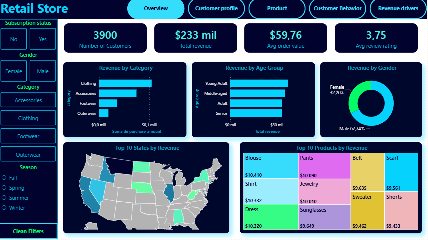
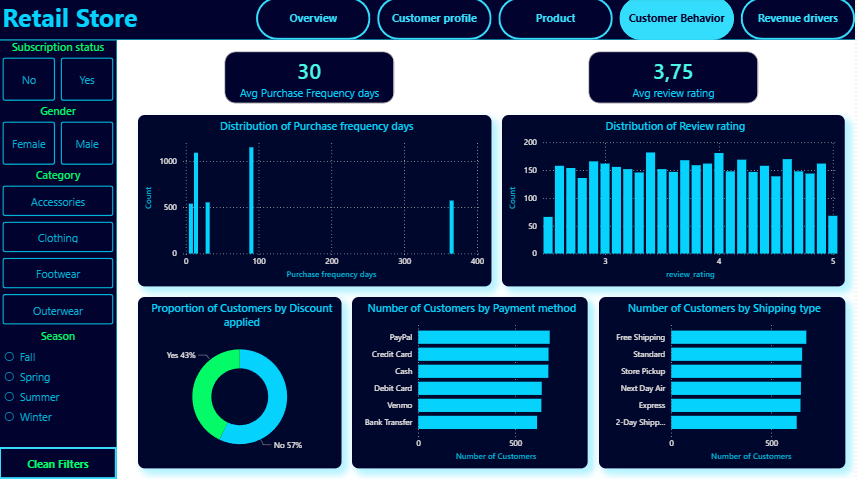

# 📊 Customer Behavior Analysis

## 📌 Project Overview

This project presents an end-to-end customer analytics solution designed to transform raw transactional data into actionable business insights.

The workflow combines **Python**, **SQL**, and **Power BI** to:
- Clean and preprocess customer transaction data
- Store structured data in a relational database
- Solve business questions using SQL
- Build interactive dashboards for decision-making

The final dashboard analyzes:
- Customer demographics
- Purchasing behavior
- Product performance
- Revenue drivers
- Customer engagement patterns

---

# 🚀 Business Problem

Companies often collect large volumes of customer transaction data but struggle to extract meaningful insights that support strategic decisions.

This project addresses key business questions such as:
- Which product categories generate the highest revenue?
- What customer segments purchase most frequently?
- Do subscribers spend more than non-subscribers?
- How do discounts impact purchasing behavior?
- Which customer groups drive the business revenue?

---

# 🛠️ Tech Stack

| Tool | Purpose |
|---|---|
| Python | Data cleaning & preprocessing |
| Pandas | Data manipulation |
| PostgreSQL | Database storage |
| SQL | Business analysis |
| Power BI | Dashboard & visualization |

---

# 📂 Project Workflow

```text
Raw Dataset
    ↓
Data Cleaning (Python)
    ↓
Data Storage (PostgreSQL)
    ↓
Business Analysis (SQL)
    ↓
Dashboard Development (Power BI)
    ↓
Business Insights & Recommendations
```

---

# 🧹 Data Cleaning & Preparation

The dataset was cleaned and transformed using Python.

### Key preprocessing tasks:
- Handling missing values
- Standardizing column names
- Removing duplicate columns
- Data type correction
- Feature engineering

### Created features:
- `age_group`
- `purchase_frequency_days`


---

# 🗄️ Database & SQL Analysis

The cleaned dataset was stored in PostgreSQL for structured analysis using SQL.

### Business analysis performed:
- Revenue analysis
- Customer segmentation
- Purchase behavior analysis
- Category performance analysis
- Subscription impact analysis

### Example SQL questions:
```sql
-- Top revenue-generating gender
SELECT gender, 
		SUM(purchase_amount) as total_revenue
FROM customer
GROUP BY gender;
```

---

# 📊 Power BI Dashboard

An interactive 5-page Power BI dashboard was developed to communicate insights effectively.

---

# 📄 Dashboard Pages

## 1️⃣ Overview Dashboard
High-level business performance summary.

### KPIs:
- Total Revenue
- Total Customers
- Average Purchase Value
- Avg review rating

### Insights:
- Revenue distribution
- Overall customer trends
- Sales performance overview

---

## 2️⃣ Customer Profile
Customer demographic analysis.

### Focus Areas:
- Age groups
- Gender distribution
- Geographic distribution

### Business Value:
Identify the most valuable customer demographics.

---

## 3️⃣ Product Analysis
Product and category performance evaluation.

### Focus Areas:
- Top-performing categories
- Most purchased products
- Seasonal purchasing trends

### Business Value:
Support product strategy and inventory decisions.

---

## 4️⃣ Customer Behavior
Analysis of customer purchasing habits.

### Focus Areas:
- Purchase frequency
- Days between purchases
- Discount usage
- Shipping preferences
- Customer review ratings

### Business Value:
Improve customer retention strategies and engagement.

---

## 5️⃣ Revenue Drivers
Identification of the key factors influencing revenue generation.

### Advanced Analytics:
- Revenue segmentation
- Decomposition Tree analysis

### Business Value:
Support strategic business decision-making.

---

# 📈 Key Insights

### Findings:
- Non subscribers demonstrated higher purchasing frequency and generates high revenue
- Clothing category is the main revenue driver
- Males represent the majority of customers (68%) and generates the highest revenue
- Montana state generates the highest revenue
- Discounts did not increase transaction volume

### Recommendation
- Improve the discount strategy
- Improve suscribers purchase offering coupons or other strategy
- Increase the supply of male products


---

# 🎯 Business Impact

This project demonstrates how data analytics can:
- Improve customer understanding
- Support revenue optimization
- Enable customer segmentation
- Drive data-informed decisions
- Transform raw data into business intelligence

---

# 📷 Dashboard Preview

## Overview Dashboard


## Customer Behavior Dashboard


---

# 📁 Repository Structure

```text
├── Dataset/
├── Notebooks/
├── Dashboard/
├── images/
├── README.md
```

---

# 🔍 Skills Demonstrated

- Data Cleaning
- Exploratory Data Analysis (EDA)
- SQL Analytics
- PostgreSQL
- Dashboard Development
- Data Visualization
- Business Intelligence
- Storytelling with Data

---